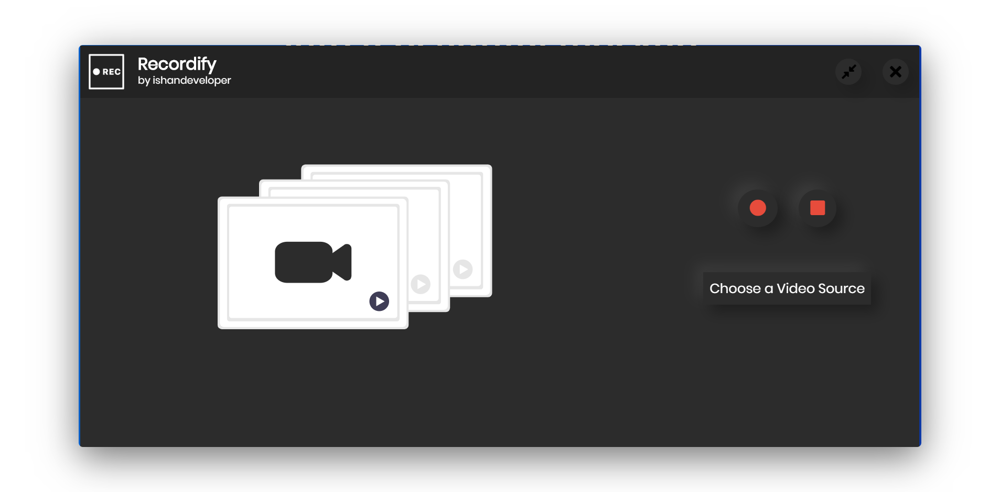

<br><br>


## 🎥 Recordify !

Recordify is an <b>⚛️ electron.js</b> based desktop app helps you to record your computer’s screen or audio. With only a few simple tools you can decide which windows of your computer are captured and converted.


## Features
* Capture Screencasts
* Capture with/without Mouse Cursor
* Capture Specific Screens or Windows

## Setup

You can either download the executable file (.exe) for your desktop or clone this repostiory and run ``` yarn run make ``` to generate a build package for your machine.

<pre> <a href="setup.exe">Download The Windows Executable (.exe) package</a></pre>


## Development

Make sure you have Node.js installed (node@^6.5.0 or higher is recommended).

* Clone the repo to your machine (or fork it to your github account then clone from there)
```bash
git clone git@github.com:ishandeveloper/Recordify.git
cd Recordify
```

  ##### To install the dependencies, simply write
```bash
yarn install
```

  ##### To run the app, simply write
```bash
yarn start
```


## Learn More

You can learn more in the [electron.js documentation](https://electronjs.org/docs).

##### Made with ♥ by <a href="https://github.com/ishandeveloper">ishandeveloper</a>

[](https://github.com/ishandeveloper)
